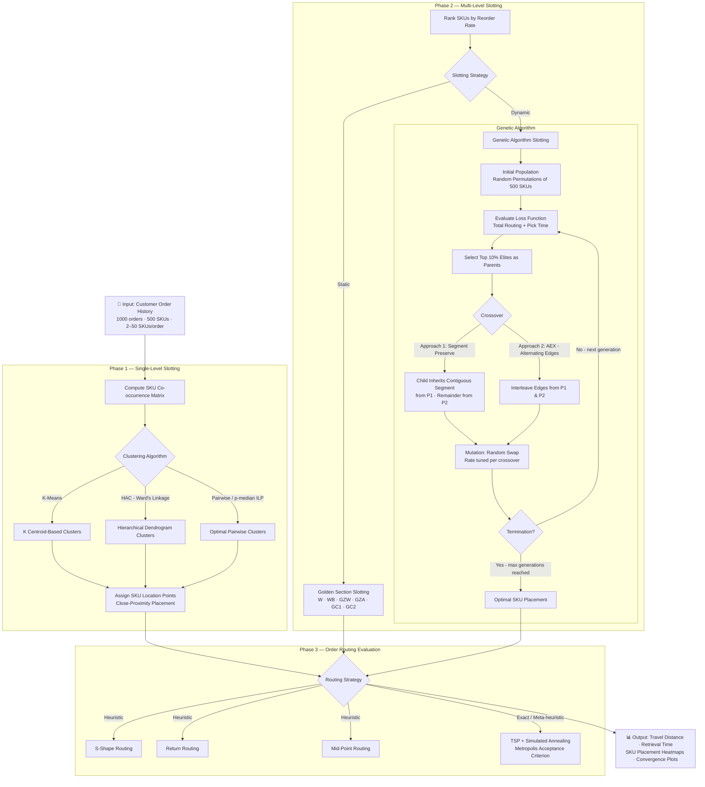

# 🏭 Warehouse Slotting & Order Routing Optimization

> **M.Tech Thesis Project — IIT Bombay | Industrial Engineering & Operations Research**
> **In collaboration with DHL Supply Chain**

[](https://www.python.org/)
[](https://numpy.org/)
[](https://pandas.pydata.org/)
[](https://matplotlib.org/)
[](https://scipy.org/)
[](https://jupyter.org/)
[](https://openpyxl.readthedocs.io/)

---

## 📋 Executive Summary

Order picking is the most labor-intensive operation in warehouse management, accounting for **55–65% of total warehouse operating costs**. Inefficient product placement (slotting) alone inflates costs by **10–30% annually**. This project addresses both problems simultaneously through a rigorous, multi-algorithm optimization framework developed in partnership with DHL.

**The core problem:** Given 500 SKUs stored across a 5-aisle, 4-level warehouse (25 columns per aisle), and a dynamic stream of ~1,000 customer orders (each containing 2–50 SKUs), find the optimal SKU-to-slot assignment that minimizes total order picker travel time and distance.

**Key achievements:**
- **Up to 43% reduction** in order retrieval time versus static Golden Zone Across Aisle (GZA) baseline
- **GA with GZA initialization converges 6× faster** than random initialization (within 200 generations vs. 1,500)
- **Pairwise Clustering** achieves the lowest average picker travel distance (93.02 m) among all single-level slotting algorithms
- Comprehensive benchmarking across **3 clustering algorithms × 4 routing strategies × 6 static slotting methods** with multiple random seeds

---

## 🗺️ Architecture & Algorithmic Pipeline



---

## ⚙️ Key Features & Methodologies

### 1. Clustering for Single-Level Slotting

SKUs that appear together in orders frequently should be stored physically close, minimizing picker travel within any given order batch.

| Algorithm | Objective | Distance Metric | Notes |
|---|---|---|---|
| **K-Means** | Minimize intra-cluster distance | Euclidean (co-occurrence vectors) | Sensitive to K and initialization seed |
| **HAC (Ward's Linkage)** | Minimize within-cluster variance agglomeratively | Euclidean | Dendrogram-based; no K required upfront |
| **Pairwise Clustering** | Solve 0-1 p-median ILP on binary order vectors | Order co-occurrence (`d_ij`) | Best empirical performance (93.02 m avg.) |

### 2. Static Slotting: Golden Section Strategies (Multi-Level)

The *golden section* is the ergonomic zone between a picker's waist and shoulders (levels 1–2 of 4). High-reorder-rate SKUs placed here eliminate unnecessary vertical reaches.

Six deterministic strategies are benchmarked:

- **W** — Within-aisle, proximity-first, no golden zone preference
- **WB** — Within-aisle with golden zone bin-swap priority
- **GZW** — Fill golden zone of each aisle fully, then non-golden
- **GZA** ⭐ — Fill golden zones *across all aisles* before any non-golden slots *(best static result)*
- **GC1** — Hybrid: GZA for 2 nearest aisles, GZW for remainder
- **GC2** — Hybrid: GZA for 4 nearest aisles, GZW for remainder

### 3. Genetic Algorithm for Dynamic Slotting

A custom GA optimizes discrete SKU-to-slot assignment in a 3D warehouse (x, y, z positions). With N=500 SKUs, the solution space is 500! — computationally intractable by exhaustive search.

**GA Configuration:**
| Hyperparameter | Value |
|---|---|
| Population size | 300 |
| Generations | 1,500 |
| Elite retention | Top 10% per generation |
| Crossover | Approach 1 (segment-preserve) or Approach 2 (AEX) |
| Mutation | Random swap; rate 0.7 (Approach 1), 0.1 (Approach 2) |
| Termination | Fixed generation count |

**Objective Function (minimize):**

```
T_total = T_routing + T_pick

T_routing  = Σ_o  route_dist(o) / v_picker      [v_picker = 1 m/s]

T_pick     = Σ_o Σ_item level_time(z_item)
             where level_time(z): z=0 → 120s, z=1 → 30s, z=2 → 30s, z=3 → 150s
```

**Location initialization matters:** Using GZA-pre-seeded positions as the chromosome encoding accelerates GA convergence significantly — reaching the W-method's final solution quality in just ~200 generations instead of 1,500.

### 4. Routing Strategies

| Strategy | Description | Complexity | Best For |
|---|---|---|---|
| **S-Shape** | Traverse entire aisles containing pick items in alternating directions | O(n aisles) | Simple, widely used in practice |
| **Return Routing** | Enter each aisle only as far as the deepest item, then return | O(n aisles) | Sparse orders with few items per aisle |
| **Mid-Point Routing** | Aisle split at midpoint; picker enters from front or back depending on item location | O(n items) | ⭐ Best heuristic performance overall |
| **TSP + Simulated Annealing** | Solve full TSP with SA meta-heuristic (Metropolis criterion, neighbour swap) | O(n² · iterations) | Optimal routing for single-level |

**SA key parameters:** Temperature reduction ratio `α` (cooling schedule) critically impacts solution quality — slower cooling yields better solutions at higher computational cost. Sensitivity analysis across multiple `α` values is included.

---

## 📊 Performance & Results

### Single-Level Slotting: Average Picker Distance (100 Orders)

| K | Seed | K-Means (m) | HAC (m) | **Pairwise (m)** |
|---|---|---|---|---|
| 5 | 30 | 98.97 | 97.19 | **96.24** |
| 7 | 30 | 98.84 | 98.52 | **98.02** |
| 9 | 30 | 97.23 | 98.05 | **96.10** |
| 5 | 88 | 87.48 | 85.33 | **85.10** |
| 9 | 88 | 86.06 | 85.09 | **84.70** |

> Pairwise Clustering consistently achieves the shortest average travel distance. HAC is a strong alternative. K-Means requires careful tuning.

### Multi-Level Slotting: Retrieval Time for 1,000 Orders (seconds)

| Slotting Method | S-Shape | Return | Mid-Point |
|---|---|---|---|
| W (baseline) | 3,396,850 | 3,725,820 | 3,193,650 |
| WB | 3,393,130 | 3,722,100 | 3,189,930 |
| GZW | 3,286,250 | 3,636,900 | 3,086,490 |
| **GZA** ⭐ | **2,785,470** | **3,259,310** | **2,635,210** |
| GC1 | 3,082,490 | 3,437,310 | 2,888,430 |
| GC2 | 2,955,910 | 3,329,840 | 2,748,470 |

> **GZA + Mid-Point Routing** is the optimal static combination.

### GA vs. Best Static Method (GZA) — 1,000 Orders

| Method | S-Shape | Return | Mid-Point |
|---|---|---|---|
| GZA (static) | 2,785,470 s | 3,259,310 s | 2,635,210 s |
| **Genetic Algorithm** | **1,583,660 s** | **2,996,870 s** | **2,424,630 s** |
| **Improvement** | **43.1% · 334 hrs saved** | **8.1% · 73 hrs saved** | **8.0% · 59 hrs saved** |

### GA Convergence: S-Shape Routing (1,500 Generations, 1,000 Orders)

| Config | Gen 0 (s) | Gen 1500 (s) | Reduction |
|---|---|---|---|
| W + S-Shape | 2,570,650 | 1,803,470 | **30%** |
| GZA + S-Shape | 2,542,790 | 1,583,660 | **38%** |

> GZA initialization not only achieves a better final solution but reaches equivalent W-method quality **6× faster** (~200 vs. 1,500 generations).

### Result Plots (see `/plots/`)

| Plot | Description |
|---|---|
| `Average_Travelling_Distance_for_Seed*.png` | Clustering algorithm comparison across seeds and K values |
| `1000_order_1500_generation_with_s_shape_routing.png` | GA convergence curve — S-Shape routing |
| `compare_*.png` | Routing strategy & slotting method comparisons (bar + box plots) |
| `visual_*.png` | Color-coded SKU placement heatmaps after GA convergence |
| `satempalpha.png` | SA temperature sensitivity analysis |
| `mutation_*.png` | Mutation rate effect on GA convergence per crossover approach |

---

## 🛠️ Installation & Usage

### Prerequisites

- Python 3.9+
- Jupyter Notebook or JupyterLab

### 1. Clone the Repository

```bash
git clone https://github.com/<your-username>/warehouse-slotting-optimization.git
cd warehouse-slotting-optimization
```

### 2. Create a Virtual Environment (recommended)

```bash
python -m venv venv
source venv/bin/activate        # macOS/Linux
# venv\Scripts\activate         # Windows
```

### 3. Install Dependencies

```bash
pip install -r requirements.txt
```

Or install manually:

```bash
pip install numpy pandas matplotlib scipy scikit-learn openpyxl jupyter
```

### 4. Launch the Notebook

```bash
jupyter notebook genetic_algo_solving.ipynb
```

### 5. Run the Full Optimization Pipeline

The notebook is structured sequentially:

| Section | Description |
|---|---|
| **Data Generation** | Synthetic reorder rates (500 SKUs), 1,000 orders with 2–50 SKUs each |
| **Single-Level Slotting** | K-Means, HAC, Pairwise Clustering + SA-TSP routing |
| **Multi-Level Slotting** | 6 Golden Section strategies evaluated across 3 routing methods |
| **Genetic Algorithm** | Full GA loop: population init → crossover → mutation → elite selection |
| **Visualization** | Convergence curves, heatmaps, comparison bar/box plots |

**To reproduce a specific experiment**, locate the corresponding markdown cell (e.g., `GZA + S-Shape 1000 orders 1500 generations`) and run from that cell onward. All key hyperparameters (population size, mutation rate, generations, routing method) are set at the top of each experiment block.

### Key Parameters to Tune

```python
POPULATION_SIZE = 300        # larger → more diverse, slower per generation
NUM_GENERATIONS  = 1500      # convergence typically within 200–400 gen for GZA init
MUTATION_RATE    = 0.7       # Crossover Approach 1 | use 0.1 for Approach 2 (AEX)
NUM_ORDERS       = 1000      # evaluation set size
NUM_SKUS         = 500       # warehouse capacity
PICKER_SPEED     = 1.0       # m/s (constant)
```

---

## 📁 Repository Structure

```
warehouse-slotting-optimization/
│
├── genetic_algo_solving.ipynb   # Main experiment notebook
├── README.md
├── requirements.txt
│
├── plots/                       # All generated result figures
│   ├── Average_Travelling_Distance_for_Seed*.png
│   ├── compare_*.png
│   ├── visual_*.png
│   ├── mutation_*.png
│   └── ...
│
└── thesis/
    └── 21319R001_MTP_Final_Stage_7.pdf   # Full M.Tech thesis
```

---

## 🔬 Tech Stack

| Library | Role |
|---|---|
| `numpy` | Distance matrix computation, array operations |
| `pandas` | Order dataset management, results tabulation |
| `matplotlib` | Convergence plots, heatmaps, bar/box charts |
| `scipy` | Spatial distance utilities |
| `scikit-learn` | K-Means clustering implementation |
| `openpyxl` | Excel-based warehouse layout visualization |
| `random` / `itertools` | Population generation, permutation handling |

---

## 📄 Citation / Thesis Reference

> Joshi, Meet Anilkumar. *Warehouse Slotting Optimization.* M.Tech Thesis, Department of Industrial Engineering and Operations Research, Indian Institute of Technology Bombay, June 2024. Supervisor: Prof. Jayendran Venkateswaran. Industry Partner: DHL Supply Chain.

---

## 🔭 Future Work

- Extend to bi-directional aisle access (currently single-side only)
- Incorporate SKU weight/volume constraints for realistic capacity modeling
- Explore LKH (Lin-Kernighan-Helsgott) TSP heuristic for routing
- Real-time re-slotting with seasonal demand shifts

---

*Built with ❤️ at IIT Bombay · IEOR Department*
