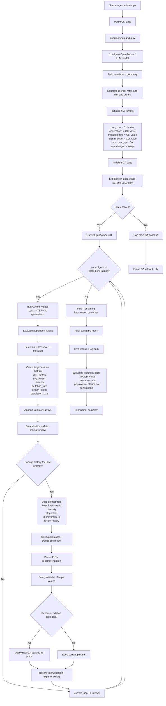

# LLM-Guided GA Experiment Flow

## Short explanation

This project runs a Genetic Algorithm, monitors the state each interval, asks an LLM to recommend changes when needed, validates those changes, and then keeps evolving until the configured generation count is reached.
