# Detailed LLM-Guided GA Experiment Flow

```mermaid
flowchart TD
    A["User runs experiment script"] --> B["parse_args"]
    B --> C["Read CLI values"]
    C --> D["Load settings and env file"]
    D --> E["OpenRouter API key loaded"]
    E --> F["Model set to deepseek v4 flash"]
    F --> G["Build warehouse geometry"]
    G --> H["Generate reorder rates and orders"]

    H --> I["Create GAParams object"]
    I --> J["initialise_ga"]
    J --> K["Create initial population"]
    K --> L["Create GAState"]

    L --> M["Create StateMonitor"]
    M --> N["Create ExperienceLog"]
    N --> O{"no_llm flag enabled?"}
    O -- Yes --> P["Disable LLMAgent"]
    O -- No --> Q["Initialise LLMAgent"]

    P --> R["current_gen = 0"]
    Q --> R

    R --> S{"current_gen < total_generations?"}

    S -- Yes --> T["Compute interval size"]
    T --> U["Run GA interval"]

    U --> U1["For each generation in interval"]
    U1 --> U2["_run_one_generation"]
    U2 --> U3["Evaluate fitness of every chromosome"]
    U3 --> U4["Find generation best"]
    U4 --> U5["Update global best route and distance"]
    U5 --> U6["Apply elitism selection"]
    U6 --> U7["Generate offspring with crossover"]
    U7 --> U8["Mutate offspring"]
    U8 --> U9["Create GenerationResult"]
    U9 --> U10["Append result to list"]
    U10 --> U11["Return updated GA state"]

    U11 --> V["Process each generation result"]
    V --> V1["Log generation summary"]
    V1 --> V2["Append best history"]
    V2 --> V3["Append mutation history"]
    V3 --> V4["Append elitism history"]
    V4 --> V5["Append population history"]

    V5 --> W["Advance generation counter"]
    W --> X["StateMonitor update"]
    X --> X1["Rolling window of recent results"]
    X1 --> X2["Compute trend metrics"]
    X2 --> X3["Check pending outcomes"]
    X3 --> X4["Update experience log if lag passed"]

    X4 --> Y{"LLM enabled and generation left?"}
    Y -- No --> S
    Y -- Yes --> Z["monitor.compute"]
    Z --> Z1{"State available?"}
    Z1 -- Yes --> AA["Build LLM prompt"]
    Z1 -- No --> S
    AA --> AB["Call LLMAgent.query"]
    AB --> AC["OpenRouter request"]
    AC --> AD["Parse JSON response"]
    AD --> AE["Extract recommended params"]
    AE --> AF["validate_and_apply"]
    AF --> AG["Clamp to safe bounds"]
    AG --> AH["Reject invalid operators"]
    AH --> AI["Apply valid updates to params"]
    AI --> AJ["Return ValidationReport"]
    AJ --> AK["Log LLM decision"]
    AK --> AL{"Recommendation changed anything?"}
    AL -- Yes --> AM["Record intervention"]
    AL -- No --> AN["Keep current params"]
    AM --> S
    AN --> S

    S -- No --> AR["Flush final pending outcomes"]
    AR --> AS["Summarise interventions"]
    AS --> AT["Print best fitness and route"]
    AT --> AU["Create summary plot path"]
    AU --> AV["plot_run_summary"]
    AV --> AW["Generate loss and parameter charts"]
    AW --> AX["Save PNG to logs"]
    AX --> AY["Experiment complete"]

    classDef llm fill:#e3f2fd,stroke:#1e88e5,color:#000;
    classDef ga fill:#e8f5e9,stroke:#43a047,color:#000;
    classDef monitor fill:#fff3e0,stroke:#fb8c00,color:#000;
    classDef output fill:#f3e5f5,stroke:#8e24aa,color:#000;

    class A,B,C,D,E,F,G,H,I,J,K,L,M,N,O,P,Q,R,S,T,U,U1,U2,U3,U4,U5,U6,U7,U8,U9,U10,U11,V,V1,V2,V3,V4,V5,W,X,X1,X2,X3,X4,Y,Z,Z1,AA,AB,AC,AD,AE,AF,AG,AH,AI,AJ,AK,AL,AM,AN,AR,AS,AT,AU,AV,AW,AX,AY ga;
    class AB,AC,AD,AE,AF,AG,AH,AI,AJ,AK,AL,AM,AN llm;
    class X1,X2,X3,X4,Z,Z1 monitor;
    class AV,AW,AX,AY output;
```

## Interpretation

This flow diagram captures the complete process of the project:

1. Configuration and setup
2. Warehouse and order generation
3. GA initialization
4. Generation-by-generation evolution
5. Fitness tracking and trend analysis
6. LLM-based tuning at intervals
7. Safety validation and clamping
8. Final logging and visualization

This version is render-safe for GitHub Markdown and still preserves the full experiment flow.
